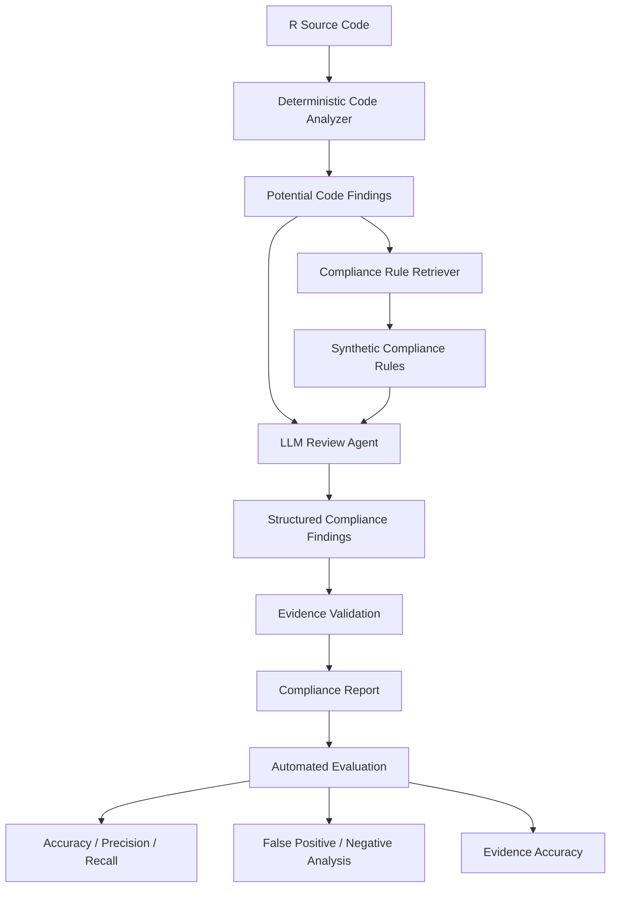

# Clinical R Code Compliance Agent

An AI-powered research prototype for assisting clinical programmers with R code compliance review using deterministic analysis, retrieval-augmented generation (RAG), LLM reasoning, evidence validation, and automated evaluation.

> **Project status:** v0.1 — Research Prototype
> **Intended use:** Educational and portfolio demonstration
> **Clinical use:** Not validated or intended for production clinical trials

---

## Overview

Clinical programming teams often perform code reviews to identify potential programming, documentation, reproducibility, and coding-standard issues.

This project explores how **Generative AI and agent-based workflows** can assist with R code compliance review while maintaining an important principle:

> **AI-generated findings should be supported by explicit evidence from the source code and the applicable compliance rule.**

The system combines deterministic code analysis with retrieval and LLM-based reasoning to produce structured, evidence-based compliance findings.

---

## Problem

Manual code compliance review can be time-consuming and may result in inconsistent identification of potential coding issues.

Traditional automated checks can identify deterministic patterns, but they may have limited ability to:

* Understand the context of R code
* Explain why a pattern may represent a compliance concern
* Connect code findings to relevant rules
* Generate human-readable recommendations
* Distinguish between different levels of potential severity

This project explores a hybrid approach that combines **software engineering techniques with GenAI**.

---

## Solution

The Clinical R Code Compliance Agent uses multiple stages:

1. **R Code Analysis**

   * Analyze submitted R source code
   * Identify deterministic patterns and potential issues

2. **Compliance Rule Retrieval**

   * Retrieve relevant synthetic compliance rules
   * Provide rule context to the reasoning layer

3. **LLM Analysis**

   * Review code in the context of retrieved rules
   * Generate structured findings

4. **Evidence Validation**

   * Require findings to reference evidence from the source code
   * Reduce unsupported or fabricated findings

5. **Structured Reporting**

   * Return standardized compliance findings
   * Include severity, evidence, recommendation, and confidence

6. **Automated Evaluation**

   * Measure detection performance
   * Track false positives and false negatives
   * Evaluate evidence and recommendation quality

---

## Architecture



### Design principle

The project intentionally separates:

```text
Deterministic analysis
        ↓
Rule retrieval
        ↓
LLM reasoning
        ↓
Evidence validation
        ↓
Evaluation
```

This separation makes it easier to understand where each finding originates and to evaluate the AI component independently.

---

## Example Workflow

### Input

```r
data <- read.csv("analysis.csv")

result <- subset(data, TRT == "ACTIVE")

mean_value <- mean(result$value)

print(mean_value)
```

### Processing

```text
R Code
  ↓
Code Analysis
  ↓
Relevant Compliance Rules
  ↓
LLM Review
  ↓
Evidence Validation
  ↓
Structured Findings
```

### Example finding

```json
{
  "rule_id": "R003",
  "severity": "Medium",
  "finding": "A hard-coded treatment value was identified.",
  "evidence": "TRT == \"ACTIVE\"",
  "recommendation": "Consider using a configurable parameter or controlled treatment definition.",
  "confidence": 0.91
}
```

> The example above is illustrative only. The project's compliance rules are synthetic and do not represent Pfizer policies, standards, SOPs, or regulatory requirements.

---

## Compliance Finding Schema

Each finding is designed to contain structured information:

| Field            | Description                                 |
| ---------------- | ------------------------------------------- |
| `rule_id`        | Identifier of the applicable synthetic rule |
| `severity`       | Potential severity of the finding           |
| `finding`        | Description of the identified issue         |
| `evidence`       | Relevant evidence from the R source code    |
| `recommendation` | Suggested remediation                       |
| `confidence`     | Model confidence in the finding             |

The goal is to make AI-generated results **traceable and reviewable**, rather than producing an unstructured narrative response.

---

## Synthetic Compliance Rules

This project uses synthetic rules created specifically for research and demonstration.

Example rule categories include:

* Missing-value handling
* Variable naming
* Hard-coded values
* Reproducibility
* Unsafe data handling

The rules are intentionally separated from the application logic so that the system can be evaluated and extended independently of the LLM.

---

## Evaluation

Evaluation is a core component of the project.

Rather than evaluating the system only through qualitative examples, the project will maintain a controlled dataset containing synthetic R code examples and expected findings.

### Planned metrics

#### Detection accuracy

Measures whether the agent identifies expected compliance issues.

#### Precision

Measures how many reported findings correspond to actual expected issues.

#### Recall

Measures how many expected issues are detected by the system.

#### False-positive rate

Measures how frequently the system reports issues that are not present.

#### Evidence accuracy

Measures whether the cited code evidence actually supports the reported finding.

#### Severity accuracy

Measures whether the predicted severity matches the expected classification.

---

## Evaluation Dataset

The evaluation dataset will contain synthetic R examples such as:

```text
evaluation/
├── dataset.jsonl
├── expected_results.jsonl
└── benchmark.md
```

Each test case can contain:

```text
R source code
       ↓
Expected rule IDs
       ↓
Expected severity
       ↓
Expected evidence
```

This creates a reproducible framework for comparing future versions of the agent.

---

## Technology Stack

### Programming

* Python 3.11+
* R

### AI / GenAI

* Large Language Model
* Retrieval-Augmented Generation (RAG)
* Structured LLM outputs

### Software Engineering

* Git
* GitHub
* Automated testing
* Modular Python architecture

### Planned Extensions

* FastAPI
* Docker
* Google Cloud
* Additional evaluation tooling

These technologies will be introduced incrementally rather than added to the initial prototype unnecessarily.

---

## Repository Structure

```text
clinical-r-code-compliance-agent/
│
├── README.md
├── AGENTS.md
├── LICENSE
├── .gitignore
├── .env.example
├── pyproject.toml
├── requirements.txt
│
├── src/
│   └── compliance_agent/
│       ├── __init__.py
│       ├── agent.py
│       ├── config.py
│       ├── prompts.py
│       │
│       ├── tools/
│       │   ├── __init__.py
│       │   ├── code_analyzer.py
│       │   ├── rule_retriever.py
│       │   └── report_generator.py
│       │
│       ├── rag/
│       │   ├── __init__.py
│       │   ├── embeddings.py
│       │   ├── retriever.py
│       │   └── vector_store.py
│       │
│       ├── evaluation/
│       │   ├── __init__.py
│       │   ├── evaluator.py
│       │   └── metrics.py
│       │
│       └── models/
│           ├── __init__.py
│           └── schemas.py
│
├── knowledge/
│   ├── rules/
│   └── metadata/
│
├── examples/
│   ├── input/
│   └── output/
│
├── tests/
│
├── evaluation/
│
├── docs/
│   ├── architecture.md
│   ├── evaluation.md
│   ├── security.md
│   └── limitations.md
│
├── notebooks/
│
└── scripts/
```

---

## Development Philosophy

The project follows a few principles.

### 1. Deterministic checks before LLM reasoning

Where an issue can be detected reliably with traditional programming techniques, the system should prefer deterministic analysis.

### 2. Evidence before explanation

An AI-generated finding should identify the code evidence supporting the conclusion.

### 3. Retrieval before reasoning

The LLM should receive relevant compliance-rule context rather than relying entirely on its pretrained knowledge.

### 4. Evaluation before optimization

New functionality should be evaluated against a controlled dataset before being considered an improvement.

### 5. Human review remains important

The system is intended to **assist** clinical programmers, not replace qualified human review.

---

## Security and Privacy

This repository is designed as a personal research project.

The project must not contain:

* Pfizer confidential information
* Pfizer proprietary source code
* Internal Pfizer SOPs or coding standards
* Real clinical trial data
* Patient-level information
* Internal Pfizer prompts or APIs
* API keys or credentials

All examples and compliance rules should be synthetic.

Secrets should be stored through environment variables and should never be committed to Git.

---

## Limitations

This project is a research prototype.

It is **not**:

* A validated clinical software application
* A regulatory submission system
* A replacement for qualified clinical programming review
* A representation of Pfizer internal coding standards
* A representation of any specific sponsor's SOPs
* A validated regulatory compliance engine

LLM-generated findings may contain false positives, false negatives, incorrect interpretations, or unsupported recommendations.

For that reason, evaluation and evidence validation are fundamental parts of the project.

---

## Roadmap

### v0.1 — Foundation

* [x] Repository structure
* [x] Synthetic compliance rules
* [x] Rule data model
* [x] Basic R code analyzer
* [x] Synthetic R test cases
* [x] Unit tests
* [x] CLI demonstration

### v0.2 — RAG

* [ ] Rule retrieval
* [ ] Embedding-based retrieval
* [ ] Retrieval evaluation
* [ ] Context construction
* [ ] Improved evidence grounding

### v0.3 — AI Agent

* [ ] LLM integration
* [ ] Structured outputs
* [ ] Compliance finding schema
* [ ] Evidence validation
* [ ] Error handling

### v0.4 — Evaluation

* [ ] Benchmark dataset
* [ ] Precision / recall
* [ ] False-positive analysis
* [ ] Evidence accuracy
* [ ] Severity evaluation
* [ ] Regression testing

### v0.5 — Application

* [ ] API layer
* [ ] Simple web interface
* [ ] Example report generation
* [ ] Dockerization

### Future

* [ ] Google Cloud deployment
* [ ] Agent observability
* [ ] Human-in-the-loop review
* [ ] Additional R analysis patterns
* [ ] Expanded evaluation framework

---

## Project Status

**Current version:** `v0.1 — Foundation`

The current focus is establishing the synthetic compliance-rule framework, deterministic analysis, evaluation dataset, and testing infrastructure before introducing more complex agent capabilities.

---

## Why This Project?

This project explores the intersection of:

```text
Clinical Programming
        +
R / Python
        +
Software Engineering
        +
Generative AI
        +
Agentic Workflows
        +
AI Evaluation
```

The long-term goal is to demonstrate how domain expertise in clinical programming can be combined with modern AI engineering techniques to build practical tools for regulated healthcare and pharmaceutical environments.

---

## Disclaimer

This is an independent personal research project.

It is not affiliated with, sponsored by, or endorsed by Pfizer.

All compliance rules, examples, datasets, and outputs used in this repository are synthetic and created for educational and research purposes.

The system should not be used to make clinical, regulatory, patient-safety, or production programming decisions.

---

## License

See [LICENSE](LICENSE) for details.
